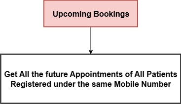

# 🏥 Doctor Clinic – WhatsApp Appointment Automation

This project automates the complete **appointment management process for Doctor Clinic** using **n8n** — from booking to payment, rescheduling, and reminders — all via **WhatsApp messages**.

---

## 🚀 Overview

This automation enables patients to interact seamlessly with the clinic through WhatsApp.
When a user sends a message for the **first time**, they are greeted with a menu of options:

```
Hello, Welcome to Doctor Clinic!
Please choose an option:

1. New Booking
2. My Upcoming Bookings
3. Reschedule Booking
4. Cancel Booking
```

Each option launches a specific workflow that manages the corresponding process end-to-end using **Airtable** for data storage and **Stripe** for online payments.

---

## 🧩 Workflows Overview

There are **four main workflows**, each implemented and orchestrated in **n8n**.

---

### 🩺 1. New Booking Flow

#### **Steps:**

1. **Patient Lookup**

   * Retrieves the list of registered patients linked to the user’s WhatsApp number from **Airtable (Patients Table)**.
   * If no patient exists, the user is prompted to add a new one (Name, Age, Gender).
   * New `patient_id` is auto-generated sequentially (e.g., `patient_5` after `patient_4`).
   * Gender inputs are normalized to `Male` or `Female`.

2. **Date Selection**

   * Uses the **Date & Time Tool** to get the current system date.
   * Displays 7 available days (today + 6 days) for the user to choose from.

3. **Time Slot Selection**

   * Generates 1-hour slots between **10:00–18:00**.
   * Excludes:

     * Slots in `not_available` from the **Config Table** (queried using the Doctor Config tool).
     * Already booked slots from the **Appointments Table**.
     * Past time slots (if booking for the current day).
   * Displays available slots in sorted order for selection.

4. **Payment Options**
   ```
   How would you like to pay?
   1. Online (Stripe)
   2. Cash at Clinic
   ```

5. **Create Appointment Record**

   * Generates a new `appointment_id` sequentially (e.g., `appointment_5`).
   * Stores all booking data in the **Appointments Table**:

     * patient_id
     * whatsapp_number
     * date (ISO 8601 format)
     * time
     * payment_method (`Stripe` or `Cash`)
     * payment_status (`Not paid`)
     * status (`Confirmed`)

6. **Confirmation Message**

   ```
   Appointment booked!
   Appointment: appointment_5
   Patient: John Doe
   Date: 2025-10-03
   Time: 15:00
   Payment Method: Cash
   Payment Status: Not paid
   Status: Confirmed
   ```


---

### 📅 2. My Upcoming Bookings Flow

#### **Steps:**

1. Gets current system date and time.
2. Fetches **all future appointments** linked to the user’s WhatsApp number and their patients.
3. Displays a list of upcoming confirmed appointments with:

   * Patient Name
   * Appointment Date
   * Appointment Time



---

### 🔁 3. Reschedule Flow

#### **Steps:**

1. **Appointment Selection**

   * Lists all *future confirmed* appointments (excluding cancelled ones).
   * Displays `appointment_id`, patient name, date, and time.
   * Asks user which one to reschedule.

2. **Date Selection**

   * Generates 7 available dates starting from today.

3. **Time Slot Selection**

   * Shows only available time slots using the same logic as the **New Booking Flow**:

     * Excludes `not_available` slots from Config Table.
     * Excludes already booked slots.
     * If rescheduling for *today*, only shows times after the current system time.

4. **Update Appointment**

   * Updates the existing appointment with the new date and time.

5. **Reschedule Confirmation**

   ```
   Your appointment has been rescheduled!
   Appointment: appointment_3
   Patient: John Doe
   New Date: 2025-10-02
   New Time: 16:00
   Status: Confirmed
   ```


---

### ❌ 4. Cancel Booking Flow

#### **Steps:**

1. **Appointment Selection**

   * Lists all *future* appointments excluding those with status `Cancelled`.
   * Displays `appointment_id`, date, and time.
   * Asks user which one to cancel.

2. **Cancellation and Confirmation**

   * Updates the selected appointment’s status to `Cancelled`.
   * Sends a confirmation message:

     ```
     Your appointment with id appointment_3 on 2025-10-02 at 16:00 has been cancelled.
     ```
   * If payment was made via Stripe, the system automatically triggers a refund.


---

## 🗂️ Airtable Database Structure

| Table            | Fields                                                                                                                 |
| ---------------- | ---------------------------------------------------------------------------------------------------------------------- |
| **Patients**     | patient_id, whatsapp_number, name, age, gender                                                                         |
| **Appointments** | appointment_id, patient_id, whatsapp_number, date, time, payment_method, payment_status, status, stripe_payment_intent |
| **Config**       | date, not_available                                                                                                    |

---

## 💳 Payment Handling (Stripe)

* Users choosing **Online (Stripe)** are redirected to Stripe payment.
* Payment method saved as `Stripe`.
* If an appointment with Stripe payment is cancelled, **refunds are automatically processed** via Stripe integration.

---

## 🔔 Daily Reminder Automation

Every morning, all patients with appointments scheduled for that day automatically receive a **WhatsApp reminder message** with:

* Appointment Date
* Appointment Time
* Patient Name

This ensures better attendance and smooth clinic operations.

---

## ⚙️ Technical Notes

* **Automation Platform:** n8n
* **Database:** Airtable
* **Payment Integration:** Stripe
* **Messaging Platform:** WhatsApp
* **Timezone:** Europe/Berlin
* **Slot Duration:** 60 minutes
* **Working Hours:** 10:00 – 18:00

---

## 🧠 Data Consistency Rules

1. **Sequential IDs:**

   * `patient_id` and `appointment_id` are generated incrementally based on the latest existing value.
2. **Gender Normalization:**

   * Store only `Male` or `Female`.
3. **Use Airtable as Source of Truth:**

   * Never rely on local memory for patient or appointment data.
4. **Date Format:**

   * Store all appointment dates in ISO 8601 format, e.g. `2025-10-03T00:00:00.000+02:00`.
5. **Memory Continuity:**

   * System remembers the user’s last step and resumes smoothly after interruptions.

---

## 💬 Error Handling

If a user sends an invalid or unrecognized input, reply:

```
Sorry, I didn’t understand that. Please reply with one of the given options.
```

---

## 🧾 Summary of User Experience

| Action                 | User Does        | System Responds                              |
| ---------------------- | ---------------- | -------------------------------------------- |
| New user sends message | Sends any text   | Receives greeting + menu                     |
| Book appointment       | Selects option 1 | Goes through patient → date → time → payment |
| Check upcoming         | Selects option 2 | Gets list of upcoming bookings               |
| Reschedule             | Selects option 3 | Chooses appointment → new date → new time    |
| Cancel                 | Selects option 4 | Chooses appointment → gets confirmation      |


---

## 📄 License

This project is for internal use within **Doctor Clinic**. Redistribution or reuse without authorization is prohibited.
